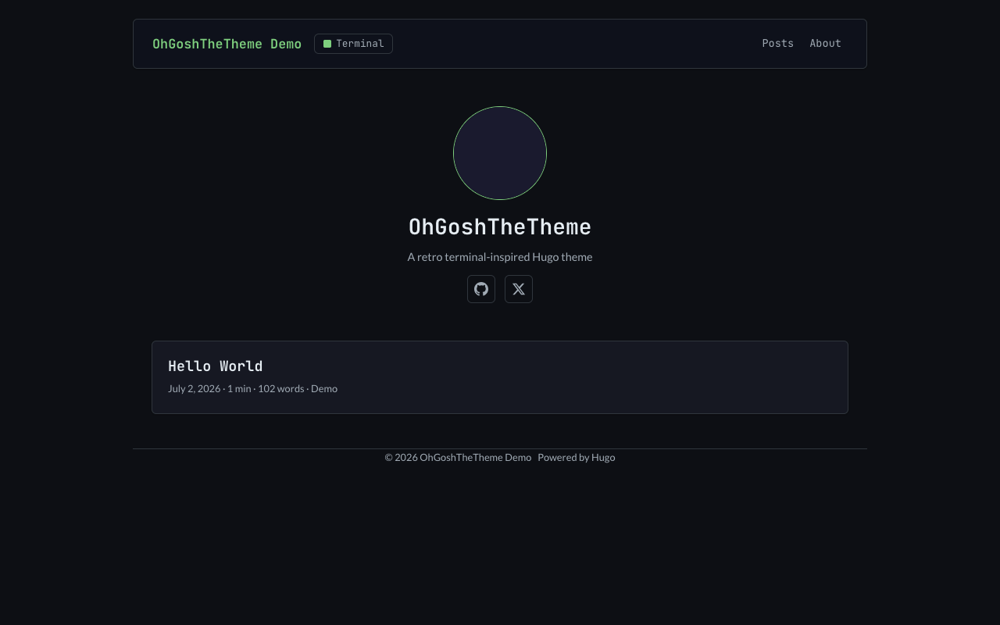
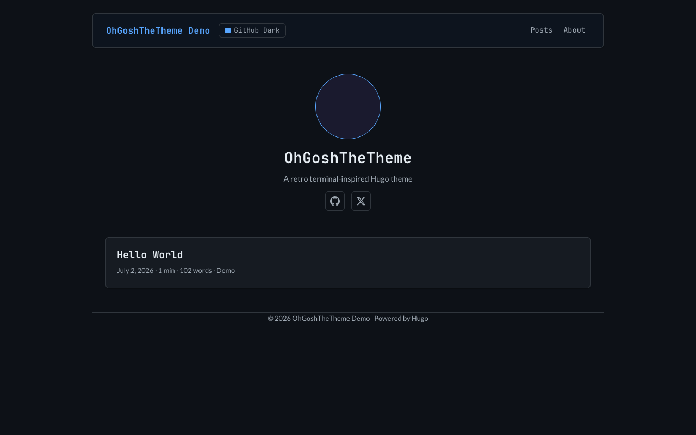
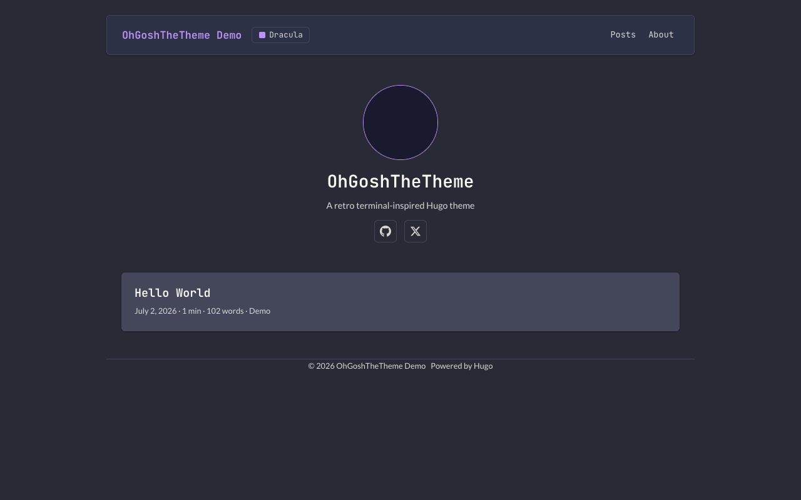
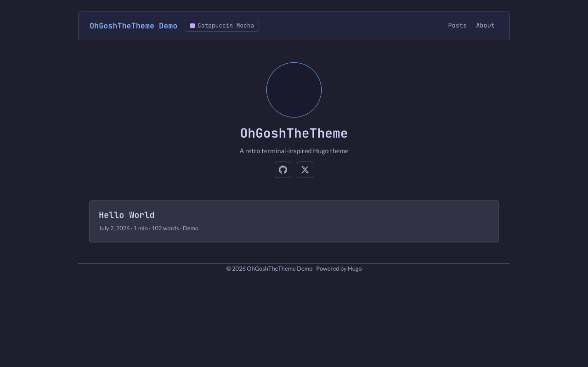
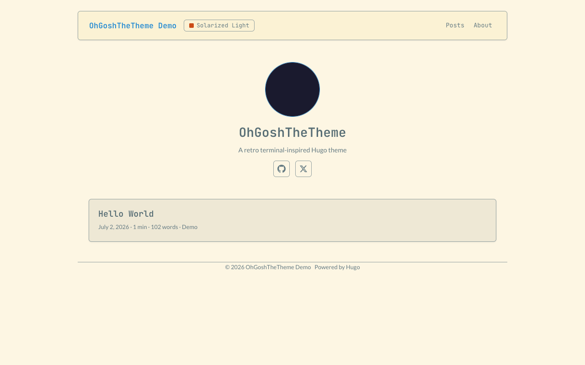
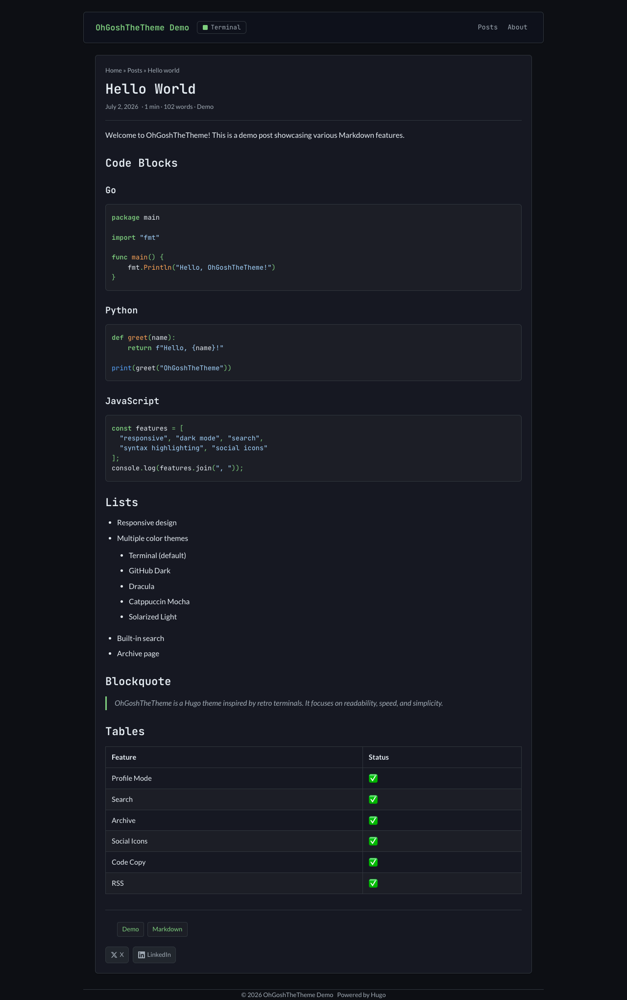
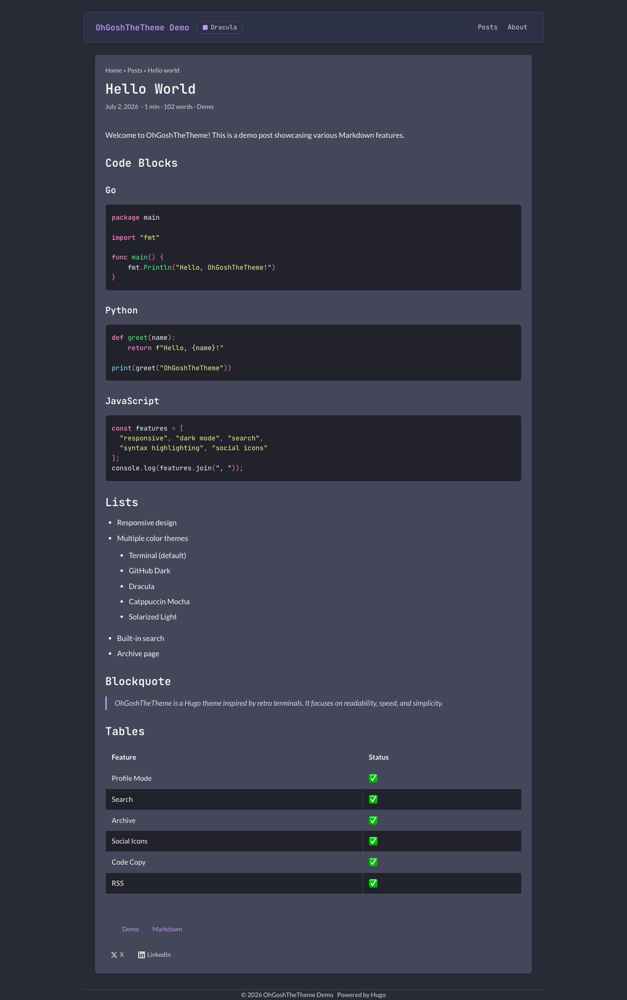
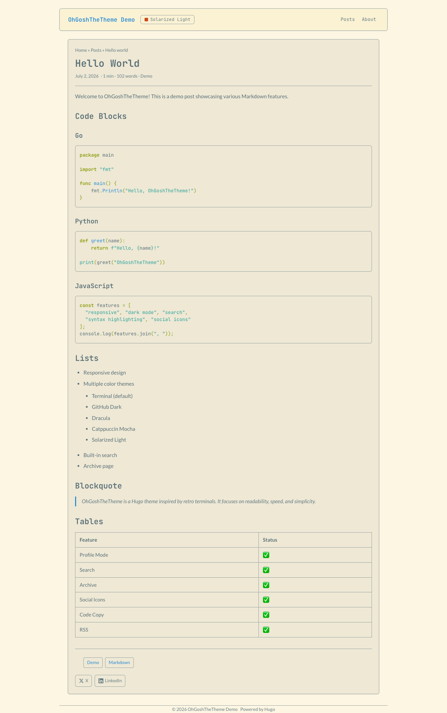

# OhGoshTheTheme

> A retro terminal-inspired Hugo theme — fast, accessible, and dripping with nostalgia.

[](LICENSE)

[](https://github.com/gandhi-jay/OhGoshTheTheme)

---

## Themes at a glance

Pick your poison — 5 hand-crafted color schemes, instantly switchable via the navbar dropdown.

| Terminal (Dark) | GitHub Dark | Dracula |
|:---:|:---:|:---:|
|  |  |  |

| Catppuccin Mocha | Solarized Light |
|:---:|:---:|
|  |  |

---

## Features

- **5 color schemes** — Terminal, GitHub Dark, Dracula, Catppuccin Mocha, Solarized Light
- **Theme switcher** — dropdown in the navbar, persisted via `localStorage`, zero flash of unstyled content
- **Profile mode** — avatar, bio, social icons, and action buttons on the homepage
- **Client-side search** — fuzzy search powered by Fuse.js (no backend needed)
- **HTMX navigation** — optional snappy page transitions via HTMX
- **Archive page** — posts grouped by year and month
- **Tags & taxonomies** — full Hugo taxonomy support
- **Breadcrumbs** — automatic navigation trail
- **Table of contents** — auto-generated from headings
- **Anchored headings** — `#` links on hover for h2-h4
- **Code copy buttons** — one-click copy on every code block
- **Syntax highlighting** — Chroma with per-theme CSS custom properties
- **Social icons** — GitHub, Twitter/X, LinkedIn, Substack, and generic link with inline SVGs
- **Share buttons** — Twitter/X and LinkedIn
- **Previous/Next post nav** — automatic pagination within sections
- **Cover images** — per-post cover image support
- **Lazy-loaded images** — via custom render hook
- **External links** — open in new tab with `rel="noopener"`
- **KaTeX math rendering** — optional LaTeX math support
- **Open Graph / Twitter Cards / JSON-LD** — structured metadata for social sharing and SEO
- **Google Analytics** — Hugo's built-in template support
- **RSS feeds** — automatic output
- **Multilingual** — i18n support with `hreflang` alternates
- **Responsive** — mobile-first responsive design
- **Scroll to top** — floating button after scrolling down
- **Extended CSS** — drop your own stylesheets into `assets/css/extended/`
- **No jQuery** — 100% vanilla ES6 JavaScript
- **Minimal dependencies** — just Hugo; KaTeX and HTMX are opt-in CDN links

---

## Quick start

### 1. Install the theme

```bash
cd your-hugo-site
git submodule add https://github.com/gandhi-jay/OhGoshTheTheme themes/OhGoshTheTheme
```

### 2. Use the theme

Add to your `config.yml`:

```yaml
theme: OhGoshTheTheme
```

### 3. Configure

```yaml
baseURL: "https://example.com/"
title: "My Site"

theme: OhGoshTheTheme

enableRobotsTXT: false
buildDrafts: true
buildFuture: true
buildExpired: true
enableEmoji: true
pygmentsUseClasses: true

params:
  # Environment
  env: development                       # set to "production" for GA, OG, Twitter, Schema
  title: "My Site"
  description: "A rad blog about things"
  author: "Your Name"
  DateFormat: "January 2, 2006"

  # Display toggles
  ShowReadingTime: true
  ShowWordCount: true
  ShowShareButtons: true
  ShowPostNavLinks: true
  ShowBreadCrumbs: true
  ShowCodeCopyButtons: true

  # Theme selector
  defaultTheme: terminal
  themes:
    - id: terminal
      label: Terminal
    - id: github-dark
      label: GitHub Dark
    - id: dracula
      label: Dracula
    - id: catppuccin-mocha
      label: Catppuccin Mocha
    - id: solarized-light
      label: Solarized Light

  # Profile mode (homepage)
  profileMode:
    enabled: true
    title: "Hi, I'm Jane"
    subtitle: "Developer & writer"
    description: "I write about code, design, and life."
    imageUrl: "/images/avatar.png"
    imageWidth: 120
    imageHeight: 120
    imageTitle: "Jane Doe"
    buttons:
      - name: Posts
        url: /posts
      - name: About
        url: /about

  # Social icons
  socialIcons:
    - name: github
      url: "https://github.com/yourhandle"
    - name: twitter
      url: "https://x.com/yourhandle"
    - name: linkedin
      url: "https://linkedin.com/in/yourhandle"
    - name: substack
      url: "https://yourhandle.substack.com"

  # HTMX nav (optional)
  htmxNav: true

  # Math rendering (optional)
  math: false

  # Footer
  footer:
    hideCopyright: false
    text: "Made with ❤️ using Hugo"

# Menu
menu:
  main:
    - identifier: posts
      name: Posts
      url: /posts/
      weight: 10
    - identifier: about
      name: About
      url: /about/
      weight: 20
    - identifier: search
      name: Search
      url: /search/
      weight: 30
    - identifier: archive
      name: Archive
      url: /archives/
      weight: 40
    - identifier: tags
      name: Tags
      url: /tags/
      weight: 50

pagination:
  pagerSize: 5
```

### 4. Create content pages

For search and archive, create the following pages:

**`content/search.md`**:
```yaml
---
title: "Search"
layout: "search"
---
```

**`content/archives.md`**:
```yaml
---
title: "Archive"
layout: "archives"
---
```

---

## Full configuration reference

| Parameter | Type | Default | Description |
|-----------|------|---------|-------------|
| `env` | string | — | `"production"` enables GA, OG, Twitter Cards, JSON-LD |
| `title` | string | — | Site title |
| `description` | string | — | Meta description |
| `keywords` | list | — | Meta keywords |
| `author` | string | — | Default author name |
| `DateFormat` | string | `"January 2, 2006"` | Date format |
| `ShowReadingTime` | bool | `false` | Show reading time |
| `ShowWordCount` | bool | `false` | Show word count |
| `ShowShareButtons` | bool | `false` | Show share buttons |
| `ShowPostNavLinks` | bool | `false` | Show prev/next post links |
| `ShowBreadCrumbs` | bool | `false` | Show breadcrumbs |
| `ShowCodeCopyButtons` | bool | `false` | Show code copy buttons |
| `ShowTags` | bool | `true` | Show tags on single post |
| `ShowToc` | bool | `false` | Show table of contents |
| `UseHugoToc` | bool | `false` | Use Hugo's built-in TOC |
| `disableAnchoredHeadings` | bool | `false` | Disable heading anchor links |
| `disableScrollToTop` | bool | `false` | Disable scroll-to-top button |
| `defaultTheme` | string | `"terminal"` | Initial color scheme |
| `themes` | list | — | Theme definitions `[{id, label}]` |
| `htmxNav` | bool | `false` | Enable HTMX navigation |
| `math` | bool | `false` | Enable KaTeX math rendering |
| `profileMode.enabled` | bool | `false` | Enable profile homepage |
| `profileMode.title` | string | site `title` | Profile heading |
| `profileMode.subtitle` | string | — | Profile subtitle |
| `profileMode.description` | string | — | Profile description (markdown) |
| `profileMode.imageUrl` | string | — | Avatar image path |
| `profileMode.imageWidth` | int | `120` | Avatar width |
| `profileMode.imageHeight` | int | `120` | Avatar height |
| `profileMode.imageTitle` | string | — | Avatar alt text |
| `profileMode.buttons` | list | — | Action buttons `[{name, url}]` |
| `socialIcons` | list | — | Social links `[{name, url}]` |
| `ShareButtons` | list | — | Which share buttons (`"twitter"`, `"linkedin"`) |
| `assets.disableFingerprinting` | bool | `false` | Disable SRI fingerprinting |
| `assets.favicon` | string | `"favicon.ico"` | Favicon path |
| `assets.favicon16x16` | string | `"favicon-16x16.png"` | 16x16 favicon |
| `assets.favicon32x32` | string | `"favicon-32x32.png"` | 32x32 favicon |
| `assets.apple_touch_icon` | string | `"apple-touch-icon.png"` | Apple touch icon |
| `assets.theme_color` | string | `"#0d0f14"` | Theme color meta tag |
| `footer.hideCopyright` | bool | `false` | Hide copyright line |
| `footer.text` | string (markdown) | — | Custom footer text |
| `fuseOpts` | object | — | Custom Fuse.js search options |
| `mainSections` | list | — | Sections to show on homepage |

### Per-page front matter

| Parameter | Type | Description |
|-----------|------|-------------|
| `hideMeta` | bool | Hide post meta (date, reading time, etc.) |
| `hideSummary` | bool | Hide summary in list views |
| `hideAuthor` | bool | Hide author |
| `hideFooter` | bool | Hide footer on this page |
| `disableShare` | bool | Disable share buttons |
| `robotsNoIndex` | bool | Add `noindex` meta tag |
| `comments` | bool | Enable comments placeholder |
| `canonicalURL` | string | Custom canonical URL |
| `math` | bool | Enable KaTeX on this page |
| `cover.image` | string | Cover image path |
| `cover.caption` | string | Cover image caption |

---

## Color schemes

| ID | Display name | Type | Accent |
|:---|:---|:---:|:---:|
| `terminal` | Terminal | Dark |  `#7ecf7e` |
| `github-dark` | GitHub Dark | Dark |  `#58a6ff` |
| `dracula` | Dracula | Dark |  `#bd93f9` |
| `catppuccin-mocha` | Catppuccin Mocha | Dark |  `#89b4fa` |
| `solarized-light` | Solarized Light | Light |  `#268bd2` |

Each theme defines 30+ CSS custom properties covering backgrounds, text, borders, code blocks, selection, buttons, tags, inputs, and syntax highlighting tokens (comments, keywords, functions, strings, numbers, etc.).

### Post view





---

## Shortcodes

### `collapse`

Collapsible content section.

```markdown

Hidden content here...

```

Optional `open` attribute to start expanded:

```markdown

You asked for it...

```

### `figure`

Enhanced image with caption, link, and attribution.

```markdown

```

### `rawhtml`

Pass raw HTML through (bypassed markdown rendering).

```markdown

<video src="/video.mp4" controls></video>

```

---

## Customization

### Extended CSS

Drop your own CSS files into your site's `assets/css/extended/` directory and they will be automatically concatenated into the stylesheet:

```
your-site/
└── assets/
    └── css/
        └── extended/
            ├── custom.css
            └── anything.css
```

### Adding a new color scheme

1. Create `assets/css/themes/06-your-theme.css` in the theme (or override via extended CSS)
2. Add your theme to the `themes` list in `config.yml`
3. That's it — it will appear in the dropdown

### Overriding partials

Place a file with the same name in your site's `layouts/partials/` directory. Hugo's lookup order will prefer your version.

---

## Development

```bash
# Clone the repo
git clone https://github.com/gandhi-jay/OhGoshTheTheme.git
cd OhGoshTheTheme

# Run the example site
cd exampleSite
ln -sf .. themes/OhGoshTheTheme
hugo server --port 1313
```

---

## License

[MIT](LICENSE) © 2026 [Jay Gandhi](https://jayg.cc/)

---

*Built with [Hugo](https://gohugo.io/) — the world's fastest framework for building websites.*
